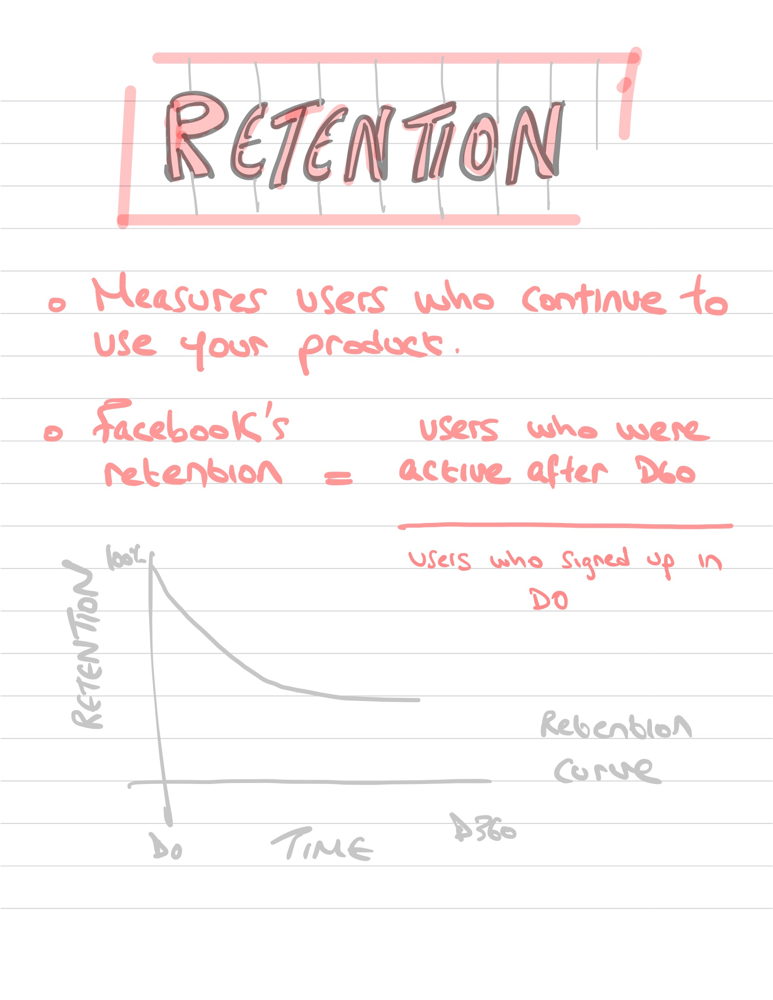
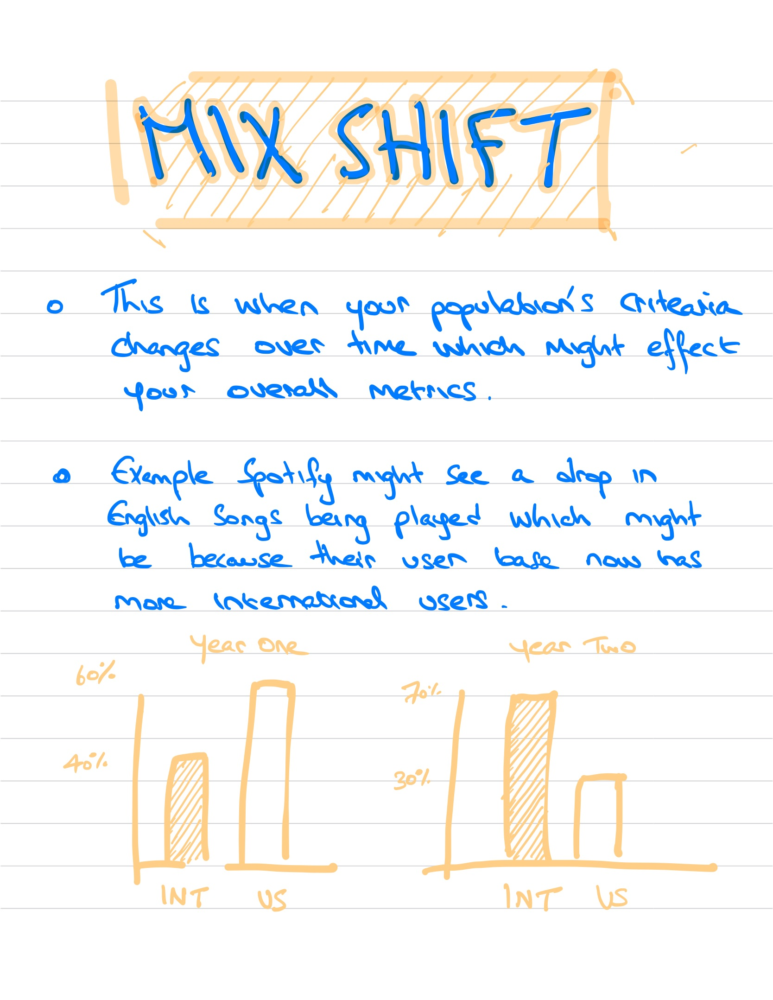

# Data Science Flashcards 

- Flashcards to make it easy to understand and memorize *Stats, ML, and Product Metrics.*  
- Friends told me these cards were super helpful for interview prep

### Contact 
- Email me at taher@mysideproject.tech if you're interested in more cards
- Please also let me know how would you order these three areas, stats & ML & product sense, in terms of importance 
